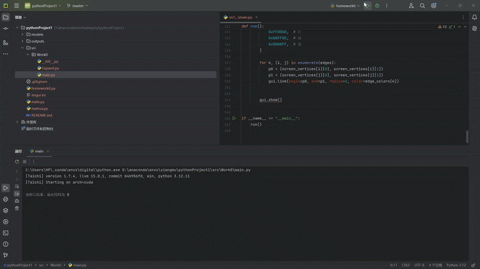

# CG-Lab

本项目为计算机图形学实验二作业，实现了三角形及立方体旋转。

## 运行效果




## 项目结构

```text
CG-Lab/
├─ README.md
├─ video.gif
└─ src/
   └─ Work0/
      ├─ __init__.py
      ├─ Expand.py
      └─ main.py
## 二、实验内容概述

本实验分为两部分：

1. 基础实验：线框三角形的 MVP 变换显示

给定三维空间中的三个顶点，通过自行实现的 Model、View、Projection 矩阵，将三维顶点变换到二维屏幕坐标，并在 Taichi GUI 窗口中绘制线框三角形。

在这一部分中，我完成了：

- 构造绕 **Z 轴旋转** 的 Model 矩阵
- 构造相机平移到原点的 View 矩阵
- 构造透视 Projection 矩阵
- 对三角形顶点执行 MVP 变换
- 完成透视除法与屏幕映射
- 使用不同颜色绘制三角形三条边
- 支持按键交互旋转

2. 选作扩展：3D 线框立方体透视旋转

在基础实验只绘制二维三角形的基础上，为了更直观地体现三维空间中的透视效果，我进一步实现了一个 **三维线框立方体**。

这一部分的主要扩展包括：

- 定义中心位于原点 `(0, 0, 0)` 的立方体
- 设置立方体的 8 个顶点与 12 条边
- 将原本用于三角形的绘制逻辑改为遍历立方体所有边进行绘制
- 使用 **绕 Y 轴旋转** 的模型矩阵，使立方体在旋转时具有明显的空间深度感
- 观察透视投影下近大远小的视觉效果

